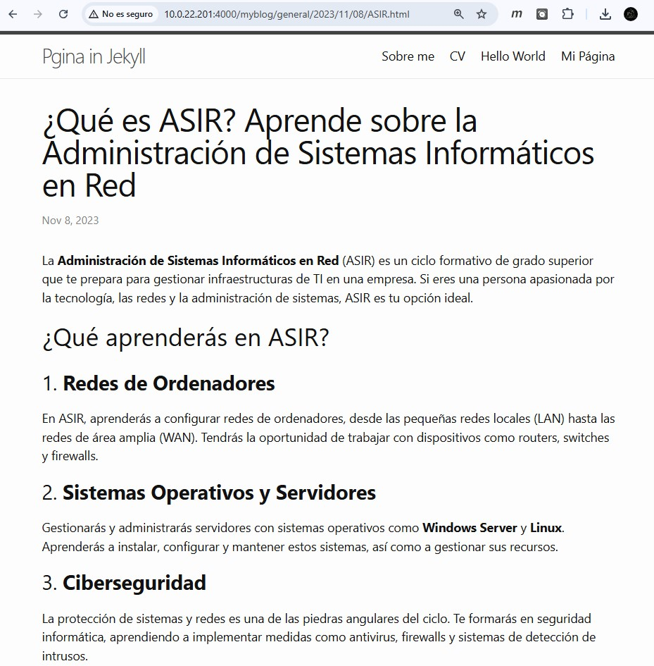

# Desplegar el Tema de Jekyll "Minima" en GitHub Pages

# Índice

- [Desplegar el Tema de Jekyll "Minima" en GitHub Pages](#desplegar-el-tema-de-jekyll-minima-en-github-pages)
- [Índice](#índice)
- [Introducción](#introducción)
- [Instalación de Jekyll](#instalación-de-jekyll)
  - [Paso 1.1: Verificar Prerrequisitos](#paso-11-verificar-prerrequisitos)
- [Crear y Configurar un Proyecto de Jekyll](#crear-y-configurar-un-proyecto-de-jekyll)
  - [Paso 2.1: Crear el Proyecto Local](#paso-21-crear-el-proyecto-local)
  - [Paso 2.2: Configurar \_config.yml](#paso-22-configurar-_configyml)
- [Desplegar el Proyecto en Local](#desplegar-el-proyecto-en-local)
- [Personalización del Sitio](#personalización-del-sitio)
  - [Paso 4.1: Modificar Páginas Predeterminadas](#paso-41-modificar-páginas-predeterminadas)
  - [Paso 4.2: Crear Nuevas Páginas y Publicaciones](#paso-42-crear-nuevas-páginas-y-publicaciones)
- [Publicar el Sitio en GitHub Pages](#publicar-el-sitio-en-github-pages)
  - [Paso 5.1: Crear un Repositorio en GitHub,y Configurar GitHub Pages en el Repositorio:](#paso-51-crear-un-repositorio-en-githuby-configurar-github-pages-en-el-repositorio)
  - [Paso 5.2: Verificar la Publicación](#paso-52-verificar-la-publicación)
- [Comprobaciones](#comprobaciones)

# Introducción

Crear y configurar un sitio web estático utilizando **Jekyll** con el **tema "minima"**. Realizaremos el **despliegue inicial** en un **servidor local** y luego lo **publicaremos en GitHub Pages**.

---
---
---

# Instalación de Jekyll

Antes de iniciar el proyecto en Jekyll, debemos instalar **Jekyll** y algunos **prerrequisitos** para que todo funcione sin problemas. Jekyll usa **Ruby** como base, por lo que necesitamos instalar Ruby y algunas herramientas adicionales.

## Paso 1.1: Verificar Prerrequisitos

Primero, confirmemos que todos los elementos básicos están instalados en nuestra máquina :

1. Verificamos que **Ruby** está instalado, ya que es el lenguaje que Jekyll usa para funcionar:
    ```
    ruby -v
    ```
    

2. Comprobamos que **RubyGems** (el gestor de paquetes de Ruby) esté disponible para instalar librerías adicionales:
    ```
   gem -v
    ```
    

3. Aseguramos que **GCC** y **Make** están presentes, ya que ayudan a compilar e instalar los paquetes de Ruby necesarios:
   ```
    gcc -v
    make -v
    ```
   ---
   ---

## Paso 1.2: Instalar Jekyll

Instalaremos *Ruby* y *Jekyll*, junto con un entorno que gestione las dependencias. Esto hace que todo el software necesario esté listo para construir el sitio :

1. **Actualizamos** el sistema :
   
   ```
    sudo apt-get update -y
    sudo apt-get upgrade -y
    ```
2. Instalamos **Ruby** y las **herramientas de construcción** necesarias para Jekyll si no los tenemos :
   
   ```
   sudo apt-get install ruby-full build-essential zlib1g-dev
    ```
3. Configuramos el entorno de instalación para gemas (paquetes Ruby) de modo que se instalen sin usar el usuario "root":
   
    ```
    echo '# Install Ruby Gems to ~/gems' >> ~/.bashrc

    echo 'export GEM_HOME="$HOME/gems"' >> ~/.bashrc

    echo 'export PATH="$HOME/gems/bin:$PATH"' >> ~/.bashrc

    source ~/.bashrc
    ```

4. Finalmente, instalamos **Jekyll** y **Bundler** para gestionar el proyecto de manera organizada:
   
   ```
    gem install jekyll bundler
    ```

---
---
---

# Crear y Configurar un Proyecto de Jekyll

Ahora que tenemos ***Jekyll listo***, vamos a crear un nuevo proyecto. ***El tema "minima"*** será aplicado por defecto, y luego configuraremos el proyecto para personalizar nuestro sitio.

## Paso 2.1: Crear el Proyecto Local

   1. Creamos una carpeta para nuestro proyecto y accedemos a ella:
        ```
        mkdir myblog
        cd myblog
        ```
        

   2. Generamos un nuevo proyecto de Jekyll en esta carpeta, lo que creará automáticamente la estructura de archivos necesaria:
        ```
        jekyll new .
        ```
        

        

   ---
   ---

## Paso 2.2: Configurar _config.yml

   El archivo **_config.yml** contiene las configuraciones de nuestro sitio. Modificarlo nos permite personalizar aspectos clave como el título y el autor.

1. Abrimos _config.yml y actualizamos los siguientes valores:

    **Title**: "mi primera pagina web in jekyll" (El título de nuestro sitio web)

    **Email**: "hafsakatkout5@gmail.com" (Correo electrónico para contacto)

    **Description**: "mi primera pagina web in jekyll." (Descripción breve que aparece en motores de búsqueda)

    **Author**: Hafsa Katkout  (Nuestro nombre como autor del sitio)

    **Baseurl**: "/myblog" indica el repositorio .

    **Url**: https://Hafsa-Katkout.github.io/myblog (URL de nuestro sitio en GitHub)

    

---
---
---

# Desplegar el Proyecto en Local

Antes de publicarlo, probaremos el sitio localmente para verificar que todo esté en orden. **Jekyll** proporciona **un servidor local** para ver el sitio en nuestro navegador.

1. Ejecutamos este comando en la terminal para **iniciar el servidor de Jekyll** :
   
   ```
    bundle exec jekyll serve --host 'ip del host'
   ```
    

   > Este comando construye el sitio y lo sirve en un servidor local, facilitando la vista previa.

2. Accedemos a http://10.0.22.201:4000 en el navegador para ver el sitio en funcionamiento:
   
   

---
---
---

# Personalización del Sitio

A continuación, vamos a **modificar** algunas páginas predeterminadas y **crear nuevas** para hacer el sitio más completo.

## Paso 4.1: Modificar Páginas Predeterminadas

1. Editar **index.markdown**
   - Añadimos un mensaje de bienvenida o un texto introductorio en la página principal del sitio.

   

2. Modificar **about.markdown**
   
   - Personalizamos about.markdown con una descripción sobre nosotros o el propósito del blog.

   

   ---
   ---

## Paso 4.2: Crear Nuevas Páginas y Publicaciones

1. Crear una **Nueva Página** :
   
   Creamos un archivo llamado **mi-pagina.md** en la carpeta principal del proyecto y le agregamos un contenido así :

   

   > Esto crea una nueva página accesible desde la URL /mi-pagina.

2. Añadir **Publicaciones** (Posts) :
   
   En la carpeta _posts, creamos al menos tres publicaciones siguiendo el formato AAAA-MM-DD-titulo.md para que se organicen cronológicamente. Ejemplos:
   - Post 1 sobre 'ASIR ':

   

   - Post 2 sobre 'DAM':

    

   - Post 3 sobre 'DAW':
    
    

3. **Actualizamos** el sitio :  
   ```
    bundle exec jekyll serve --host 'ip del host'
   ```
4. **Comprobamos** que todo esta bien mientras entramos accedemos al sitio desde el navegador :
   
   
   

---
---
---

# Publicar el Sitio en GitHub Pages

## Paso 5.1: Crear un Repositorio en GitHub,y Configurar GitHub Pages en el Repositorio:

1. Creamos un **nuevo repositorio** en GitHub llamado **myblog**.
   
2. creamos la rama **gh-pages** :
   
   

3. Vinculamos nuestro proyecto local con el repositorio remoto y subimos el código :
   
   ```
    git init
    git remote add origin https://github.com/tuusuario/myblog.git
   ```
    

    ```
    git add .
    git commit -m "..."
    ```
    

    ```
    git push --set-upstream origin gh-pages
    ```

    

    

    ---
    ---

## Paso 5.2: Verificar la Publicación

Abrimos el enlace que GitHub proporciona para nuestro sitio (por ejemplo, https://Hafsa-Katkout.github.io/myblog) y comprobamos que el sitio está en línea y funcional.


# Comprobaciones


- **Comprobamos el post Asir :**



- **Comprobamos el post DAW :**


- **Comprobamos el post DAM:**


- **Comprobamos la pagina mi-pagina :**


- **Comprobamos los cambios en about.md :**


